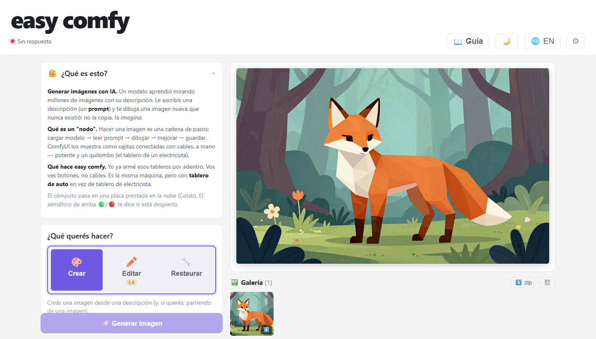
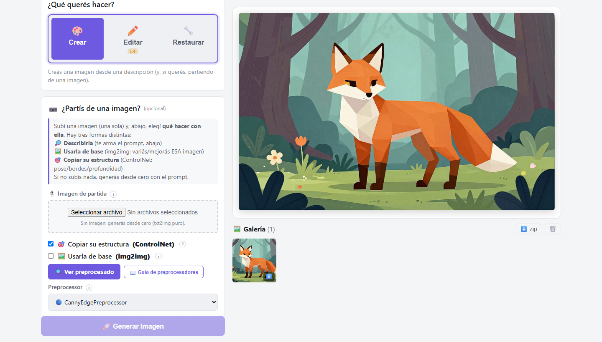
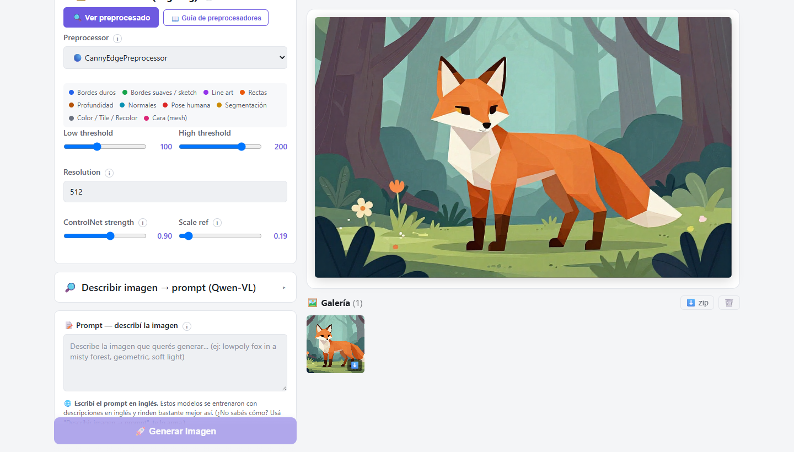
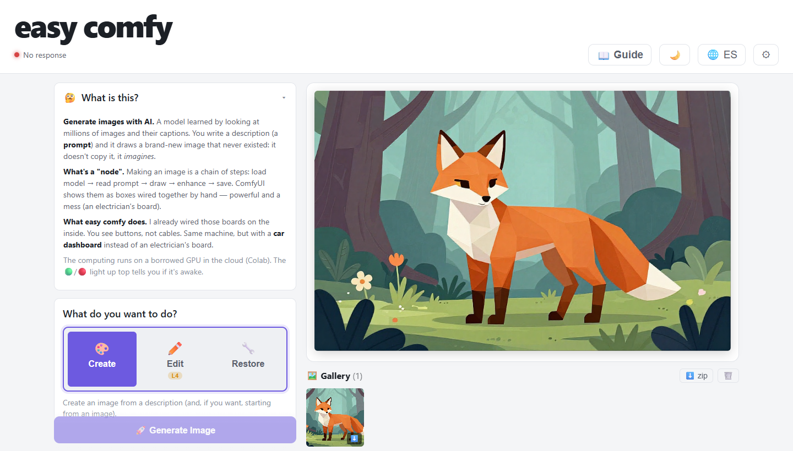

# comfyweb — *easy comfy*

Una UI web simple para generar imágenes con **ComfyUI**, sin tener que armar el grafo de nodos
a mano. Vos escribís lo que querés, elegís un modo, y comfyweb le habla por detrás a una
instancia de ComfyUI (local o en la nube) y te devuelve la imagen.

La gracia: **el cómputo (la GPU) no corre en tu PC** — corre en un **Google Colab gratuito**.
comfyweb es solo la interfaz liviana que corre en tu máquina y le manda los pedidos al Colab.

```
   Tu navegador  ─►  comfyweb (Node, tu PC)  ─►  ComfyUI + GPU (Google Colab)
   localhost:8085                                 (túnel público de Cloudflare)
```

---

## Cómo se ve · What it looks like

Interfaz bilingüe (Español / English) — al abrir elegís idioma, y podés cambiarlo cuando quieras
con el botón 🌐. *Bilingual UI — pick your language on start, switch anytime with the 🌐 button.*

**Español**





**English**




> La imagen del zorro es un ejemplo generado con este mismo pipeline (Z-Image Turbo).
> *The fox image is a sample generated with this same pipeline (Z-Image Turbo).*

---

## Son dos partes (y las dos son tuyas)

1. **comfyweb** (este repo) — la UI, corre en tu PC.
2. **El Colab** — la GPU. Vive en un repo aparte:
   **https://github.com/nadikka/comfy-colab-leo** (notebook `ComfyUI_Web.ipynb`).

El Colab lo abrís y corrés **en tu propia cuenta de Google** — usás *tu* GPU gratis, no la de
nadie más. El notebook baja los modelos a *tu* Google Drive y te da una URL pública para
conectar tu comfyweb. Todo bajo tu cuenta, sin depender de que otra persona esté online.

> Podés abrir el notebook directo en Colab acá:
> https://colab.research.google.com/github/nadikka/comfy-colab-leo/blob/master/ComfyUI_Web.ipynb

---

## Qué necesitás (una sola vez)

1. **Node.js** instalado (v18 o mayor) → https://nodejs.org (botón "LTS").
2. Una **cuenta de Google** (para el Colab). No hace falta pagar nada.

No necesitás instalar ComfyUI, ni modelos, ni Python en tu PC. Todo eso vive en el Colab.

---

## Cómo se usa (cada vez, ~3 minutos)

### Paso 1 — Prender la GPU en Colab

1. Abrí el notebook: **https://colab.research.google.com/github/nadikka/comfy-colab-leo/blob/master/ComfyUI_Web.ipynb**
2. Arriba a la derecha, elegí una GPU: **Entorno de ejecución → Cambiar tipo de entorno → T4** (gratis).
3. **Entorno de ejecución → Ejecutar todo.** La primera vez baja los modelos a *tu* Google Drive
   (~14 GB, tarda un rato); las siguientes veces arranca en 2-3 min.
4. Cuando termine, abajo del todo imprime una **URL pública**, tipo:
   ```
   URL PÚBLICA (random, pegala en comfyweb):
   https://algo-algo-algo.trycloudflare.com
   ```
   **Copiá esa URL.** (Cambia cada vez que reiniciás el Colab — es normal.)

### Paso 2 — Prender comfyweb en tu PC

En una terminal, parado en esta carpeta:

```bash
npm install     # solo la primera vez
npm start
```

- **Windows:** también podés hacer doble clic en `run-colab.bat`.
- **Mac / Linux:** también podés correr `./start.sh`.

Se abre en **http://localhost:8085**.

### Paso 3 — Conectar y generar

1. En comfyweb, clic en **"Colab (Cloudflare)"**.
2. Pegá la URL `...trycloudflare.com` del Paso 1 y **"Guardar y Conectar"**.
3. Escribí tu prompt, elegí un modo y generá. Listo.

---

## Notas

- La URL del Colab **cambia** cada vez que reiniciás el notebook. Si perdés conexión,
  reejecutá la última celda del Colab, copiá la URL nueva y pegala de nuevo en el botón "Colab".
- comfyweb guarda tu URL en `config.json` (queda solo en tu PC, no se sube al repo).
- Si querés generar contra un ComfyUI **local** en vez de Colab, pegá `http://localhost:8188`.

---

## Créditos

comfyweb está construido sobre [**comfyweb** de jpupper](https://github.com/jpupper/comfyweb)
(el puente base ComfyUI↔web). La capa *easy comfy* (UI de intención, modos, integración con el
notebook de Colab de Z-Image) es trabajo propio sobre esa base.

<br>

---

# 🇬🇧 English

A simple web UI to generate images with **ComfyUI**, without wiring the node graph by hand. You
write what you want, pick a mode, and comfyweb talks to a ComfyUI instance (local or in the cloud)
behind the scenes and returns the image.

The trick: **the computing (the GPU) doesn't run on your PC** — it runs on a free **Google Colab**.
comfyweb is just the lightweight interface that runs on your machine and sends the requests to Colab.

```
   Your browser  ─►  comfyweb (Node, your PC)  ─►  ComfyUI + GPU (Google Colab)
   localhost:8085                                   (Cloudflare public tunnel)
```

## Two parts (and both are yours)

1. **comfyweb** (this repo) — the UI, runs on your PC.
2. **The Colab** — the GPU. It lives in a separate repo:
   **https://github.com/nadikka/comfy-colab-leo** (notebook `ComfyUI_Web.ipynb`).

You open and run the Colab **in your own Google account** — you use *your* free GPU, nobody else's.
The notebook downloads the models to *your* Google Drive and gives you a public URL to connect your
comfyweb. All under your account, without depending on anyone else being online.

> Open the notebook directly in Colab here:
> https://colab.research.google.com/github/nadikka/comfy-colab-leo/blob/master/ComfyUI_Web.ipynb

## What you need (once)

1. **Node.js** installed (v18 or newer) → https://nodejs.org ("LTS" button).
2. A **Google account** (for Colab). No payment required.

You don't need to install ComfyUI, models, or Python on your PC. All of that lives on Colab.

## How to use it (each time, ~3 minutes)

### Step 1 — Start the GPU on Colab

1. Open the notebook: **https://colab.research.google.com/github/nadikka/comfy-colab-leo/blob/master/ComfyUI_Web.ipynb**
2. Top right, pick a GPU: **Runtime → Change runtime type → T4** (free).
3. **Runtime → Run all.** The first time it downloads the models to *your* Google Drive
   (~14 GB, takes a while); after that it starts in 2-3 min.
4. When it finishes, at the very bottom it prints a **public URL**, like:
   ```
   URL PÚBLICA (random, pegala en comfyweb):
   https://something-something.trycloudflare.com
   ```
   **Copy that URL.** (It changes every time you restart Colab — that's normal.)

### Step 2 — Start comfyweb on your PC

In a terminal, inside this folder:

```bash
npm install     # first time only
npm start
```

- **Windows:** you can also double-click `run-colab.bat`.
- **Mac / Linux:** you can also run `./start.sh`.

It opens at **http://localhost:8085**.

### Step 3 — Connect and generate

1. In comfyweb, click **"Colab (Cloudflare)"**.
2. Paste the `...trycloudflare.com` URL from Step 1 and click **"Save & Connect"**.
3. Write your prompt, pick a mode and generate. Done.

## Notes

- The Colab URL **changes** every time you restart the notebook. If you lose connection,
  re-run the last Colab cell, copy the new URL and paste it again into the "Colab" button.
- comfyweb saves your URL in `config.json` (stays only on your PC, not pushed to the repo).
- To generate against a **local** ComfyUI instead of Colab, paste `http://localhost:8188`.

## Credits

comfyweb is built on top of [**jpupper's comfyweb**](https://github.com/jpupper/comfyweb)
(the base ComfyUI↔web bridge). The *easy comfy* layer (intent-based UI, modes, integration with the
Z-Image Colab notebook, bilingual UI) is my own work on that base.
